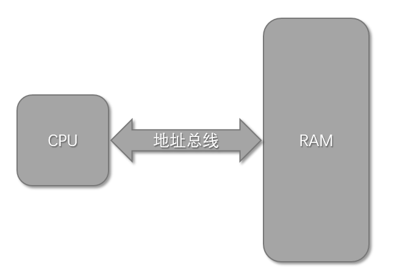
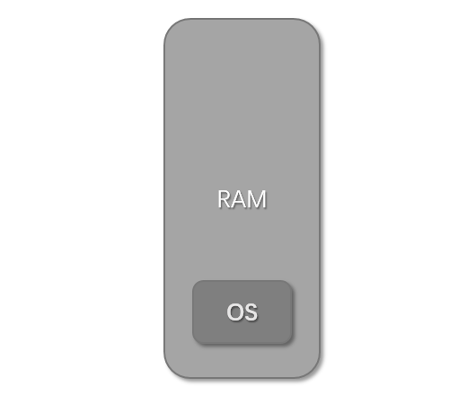
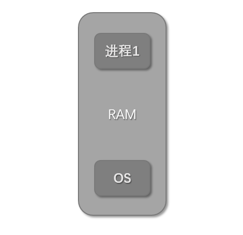
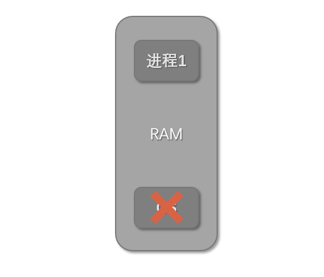
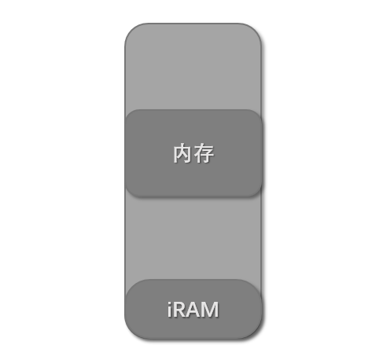
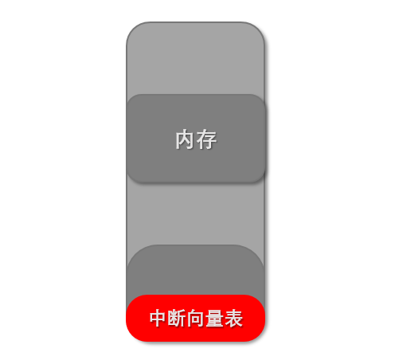
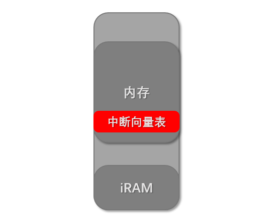
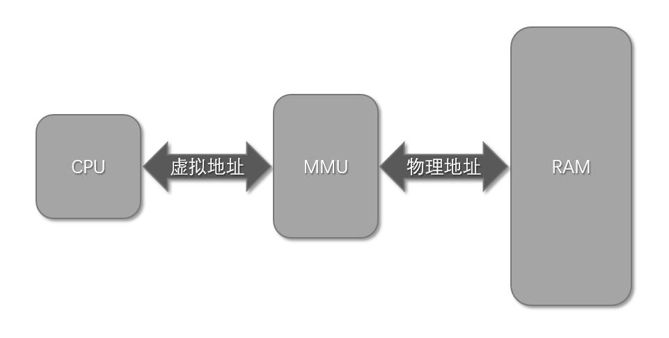
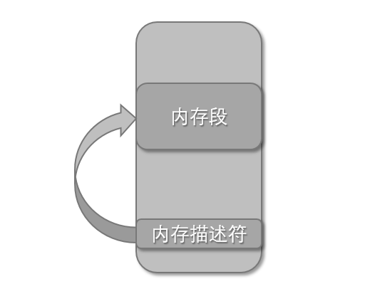

## 第1章：MMU、CACHE和TLB简介
### 1.1、前言
MMU、TLB和CACHE是计算机系统中经常用到同时又经常被忽视的部件，网上关于MMU的资料绝大部分是介绍了其页表的映射方法，但是并没有或者很少介绍计算机系统引入MMU的原因。本帖介绍了引入MMU的两个原因，同时介绍了ARM体系的Cache和TLB及其基本操作。

### 1.2、真真假假，假假真真----MMU

正如世上没有无缘无故的爱，也没有无缘无故的恨，MMU也不是无缘无故就出现的，一个新事物的诞生往往是为了解决某种需求，MMU也一样。

#### 1.2.1、MMU诞生原因之一：解决内存访问安全问题
在很久之前，CPU访问内存的方式是直接通过地址总线来访问内存，CPU发到地址总线上的信号就叫做物理地址。以intel的16位处理器8086为例，8086共有20根地址线，能访问1MB的内存，是直接通过物理地址来访问内存：

由于程序能直接访问物理内存，那么只要知道了物理内存基址和大小，就可以访问到整个内存空间，这样就带来了安全问题，比如下面的例子：
- 系统启动时OS被加载到内存中运行

- OS加载了一个程序到内存中运行

- 进程1只有一个功能，就是从内存基址开始，将内存的值都改写成0，这样系统内核就被破坏，整个系统宕机

通过上面简单的例子可以看出，直接使用物理地址访问内存是多么的危险。产生这种危害的主要原因就是没有对访问的内存的属性做出规定和检查，也就是某个内存段的可读、可写和可执行问题。

#### 1.2.2、MMU诞生原因之二：解决地址映射问题
这个以ARM中的中断向量表为例，在ARM体系中，地址空间分配一般如下：

在0地址处的一般是CPU内部的内存iRAM或者是外部的Norflash，而外接的内存地址一般都不是从0地址开始，比如2440的内存基址就是从0x30000000。在ARM体系中，当发生中断后，CPU自动跳转到存放在0地址处的中断向量表中去执行（假设不使用高内存中断向量表），如下图：

但是，一旦引入了操作系统，一切都开始变得复杂起来。操作系统的内核是运行在内存空间的，内核也有自己的中断向量表，而且这个中断向量表是在内存中的，而不是在0地址处的iRAM或者是外部的Norflash中。如下图所示：

按照操作系统设计者的意图，发生中断后，CPU应该跳转到内存中的中断向量表中去执行。但是，理想很美好，现实很残酷，CPU可没有那么聪明，当发生中断后，它还是跳转到0地址处的中断向量表去执行，这样就背离了设计者原本的意图。

CPU无论进行取指令还是读写数据，都是对内存进行访问操作。当发生中断后，假设CPU跳转到0地址处执行，CPU需要访问0地址以取出指令。如果有这样一种硬件，能将CPU访问0地址改变成访问内中的中断向量表地址，假设内存中的中断向量表的地址是0x30001000，也就是将0x00000000地址映射为0x30001000地址，就能解决上面的问题了。

#### 1.2.3、MMU的诞生
为了解决内存访问安全问题和地址映射的需求，迫切地需要添加这样一个模块：

- 拦截CPU发出的地址信号，然后对地址做一些属性检查。
- 将CPU发出的地址按照某种规则转换成另一个地址，然后通过地址总线访问内存。

这样的模块就叫做MMU(Memory Management Unit)，同时将CPU和MMU之间的地址信号叫做虚拟地址，将MMU和内存之间的地址信号叫做物理地址。

#### 1.2.4、内存描述符
MMU通过内存描述符来描述一段内存区域的属性和虚实地址映射关系。

- 内存属性表示物理内存段可读、可写、可执行、是否存在这几种属性，其中是否存在是为了支持虚拟存储而提出的一个属性。如果存在，则可以进行属性检查、地址变换；如果不存在，则产生一个异常。
- 虚实地址映射描述了虚拟地址和物理地址之间的转换关系。

那么内存描述符存放在哪呢？首先不可能在MMU内部放置存储空间用于存放内存描述符，因为内存描述符数量很多，而像寄存器这种存储介质单位造价又很高，从成本上考虑必须要另寻存放空间。容量足够造价又低的存储介质是什么呢？当然是内存啦。想想是不是很有趣呢，用来描述内存的描述符它自己也在内存里。

### 1.3、天下武功，无坚不破，唯快不破----CACHE

世上本没有Cache，内存的速度跟不上了，也就有了Cache。

在计算机系统中，CPU的速度比内存的速度快很多，当CPU从内存中取数据或者指令时，通常需要几十、几百个时钟周期，这大大地影响了整个系统的性能。为了解决内存速度低下的问题，设计者们在CPU的内部放置了一些SRAM用于缓存数据和指令，来提高CPU访问指令和数据的速度。这些SRAM就叫做Cache（缓存）。

以下讲的Cache都是基于ARM体系的。

### 1.3.1、Cache的两种写方式
- 写通方式。每次CPU修改了Cache中内容时，Cache同时更新相应内存中的内容。
- 写回方式。CPU修改Cache内容后，Cache并不会立即更新内存中的内容，而是等到某种原因需要覆盖Cache中的数据，Cache才会将之前修改的数据同步到内存中相应的位置。

### 1.3.2、添加内存描述符内容
当引入了Cache功能之后，我们的内存描述符就要做一点点改动了。主要就是在描述符中添加了另外2个功能：

- 是否使用Cache功能。这不是指使能/关闭Cache功能，而是指“想不想用”Cache功能。因为需要对每个描述符描述的内存段分别进行Cache使用与否控制，所以需要在描述符中添加这一功能。
- Cache的写类型。这个就是标明描述符描述的内存段使用的Cache是写通类型还是回写类型的。

### 1.3.3、Cache的基本操作
- 失效操作。失效操作目的是丢弃Cache中的数据以重新从内存中获取数据。失效并不是将Cache中的数据写为0，而是将Cache中一个标志位置1，标明这些数据已经被废弃，当重新从内存中缓存数据时，这个标志位会被自动置为0。指令和数据Cache都有这个操作。
- 回写操作。这个操作只有数据Cache才有，因为指令Cache中内容不会被改写，只会被替换，所以不需要回写。回写操作将数据Cache中的内容更新到相应的内存中。
- 回写并失效操作。同样这个操作只有数据Cache才有。

### 1.4、众里寻她千百度，蓦然回首，那人却在，灯火阑珊处--TLB

当使用MMU后，带来了一个新的问题：在没有使用MMU之前，从内存中取指令和数据只需访问一次内存即可。但是使用MMU之后，就需要两次了，第一次访问内存是为了获得内存描述符，第二次访问内存才是真正的获取指令或者数据。本来一次就能获得想要的东西现在变成两次才能得到，而且内存访问本来就慢，现在还要访问两次，岂不是降低了系统的性能？答案是：没错，确实是这样。

### 1.4.1、TLB的引入
解决方法就是在MMU内部使用Cache，将最近使用的内存描述符缓存在Cache中，这样MMU就不需要去内存中获取内存描述符了。这个MMU中的Cache不同于指令和数据Cache，它有一个专门的名字，叫TLB(Translation Lookaside Buffers)，简称为快表。

### 1.4.2、TLB的基本操作
- 失效TLB。TLB的操作只有一种，就是将TLB中的内容丢弃，以重新从内存中缓存新的内存描述符，这点是跟指令和数据Cache一样的。指令TLB和数据TLB都有这个操作。

